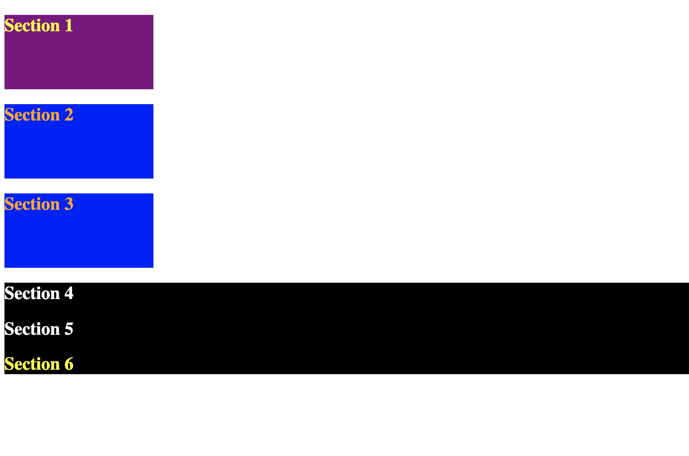

# 📖 Add Color to HTML Page Using CSS

Work with a partner to implement the following user story:

* As a developer, I want to use CSS to style my HTML page. 

## Acceptance Criteria

* It's done when the HTML page has been linked with the external CSS style sheet. 

* It's done when `Section 1` has a background color of purple and the text is yellow.

* It's done when `Section 2` and `Section 3` have a background color of blue and the text is orange.

* It's done when the `container` has a background color of black.

* It's done when `Section 4` and `Section 5` have a text color of white..

* It's done when `Section 6` has a text color of yellow.

* It's done when the finished page matches the mockup. 

## 📝 Notes

Refer to the documentation: 

[MDN Web Docs on color](https://developer.mozilla.org/en-US/docs/Web/CSS/color)

[MDN Web Docs on getting started With CSS](https://developer.mozilla.org/en-US/docs/Learn/CSS/First_steps/Getting_started)

## Assets

The following image demonstrates the web application's appearance and functionality:

---

## 💡 Hints

How can we use the `<link>` element inside the `<head>` to connect the HTML to the CSS?

## 🏆 Bonus

If you have completed this activity, work through the following challenge with your partner to further your knowledge:

* How can we use color to help make your website accessible to users? What color combinations should be avoided? 

Use [Google](https://www.google.com) or another search engine to research this.

---
© 2022 edX Boot Camps LLC. Confidential and Proprietary. All Rights Reserved.
